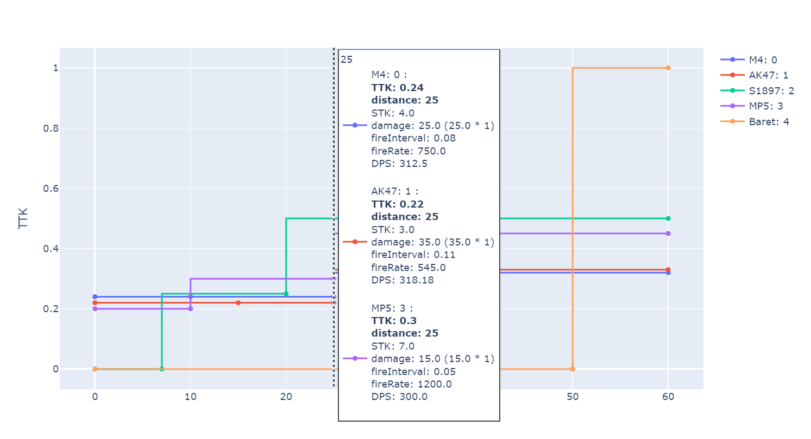

# FPS数据解析器 (CN)
[](https://github.com/June12138/ShooterGameStatAnalyser/blob/main/README-EN.md)
## 介绍
FPSDataAnalyser是一个用于分析FPS游戏数据的小工具，可以解析.xlsx文件，并生成不同武器在不同距离上的图表。（目前只有TTK图表，其实小改一下代码就能生成别的）。

鼠标悬浮在图表上可以查看具体数值，STK、伤害、射速那些的，方便比较。

## 使用方法
1. 下载到本地
2. CD到项目目录
3. 终端运行：
```
pip install -r requirements.txt
jupyter notebook
```
4. 在新弹出的浏览器窗口中运行main.ipynb。第二次运行的时候直接运行jupyter notebook即可。

## 设置说明
- 所有设置都在settings.xml中
- sheet标签中，
  - **path**为.xlsx文件路径；
  - **sheetName**为工作表名称；
  - **idField**为id主键字段名称；
  - **skipRows**为程序需要忽略掉的行数（从零开始，比如你的表格中第一行是中文注释，第二行是实际表头，就填0把第一行跳过）；
  - **separator**为表格中用来分隔数组的符号（比如你的表格中，伤害距离和伤害值是用空格分隔的，就填空格）。
- fieldNames标签中，
  - **idField**为id字段名称；
  - **name**为武器名称的字段名称；
  - **damageDistanceSegmentation**为伤害衰减分隔距离的字段名称；
  - **damageSegmentation**为在不同距离上的实际伤害的字段名称（以后会支持按伤害倍率计算伤害衰减的模式）；
  - **bulletsPershot**为每次攻击时发射的子弹数量的字段名称；
  - **fireRate**为每次射击的间隔的字段名称。（单位为秒，以后也会支持微秒和RPM等射速单位）
- general标签中，
  - **interpolation**为程序所绘制出的表格的插值模式，默认vh，不同的插值模式详见plotly官网；
  - **health**为预设的血量。

具体可以看一眼tables/Weapons.xlsx作为参考